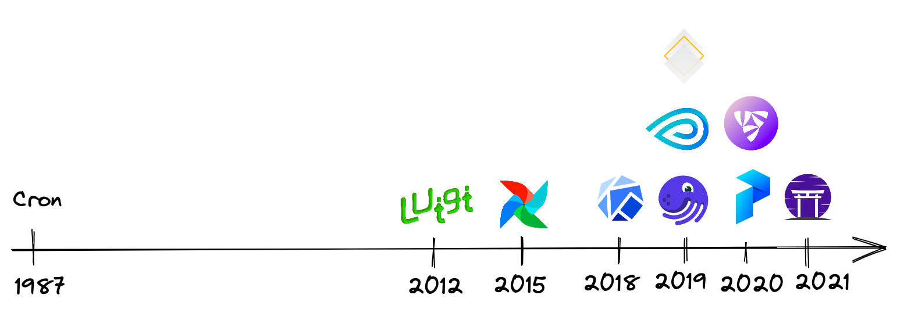

### Bức tranh tổng quan
Airflow là một pipeline orchestration tool trong MLOPs, ngoài ra còn có một số tool khác như cron, luigi, airflow, kubeflow, kedro, metaflow, dagster, flyte, prefect, and zenml (left to right; top to bottom)

### Airflow Architecture
